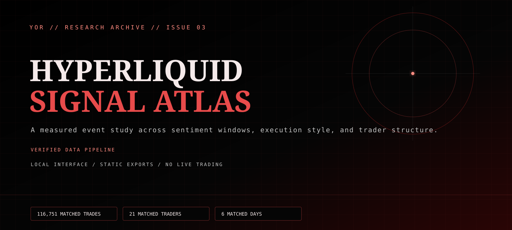
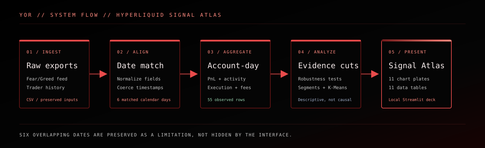

# Hyperliquid Signal Atlas



`VERIFIED DATA PIPELINE` · `LOCAL RESEARCH INTERFACE` · `NO LIVE TRADING`

Hyperliquid Signal Atlas is an evidence-first research project that joins a Bitcoin Fear/Greed feed with a Hyperliquid trader export. It turns the matched rows into account-day tables, descriptive comparisons, clustering views, and a local Streamlit command deck.

The repository is deliberately framed as an event study. The two source files overlap on six calendar dates, so the results describe those observed windows; they are not a continuous daily backtest, a causal market model, or financial advice.

## What the checked-in pipeline currently measures

| Measure | Verified value |
| --- | ---: |
| Trades in the trader export | 136,255 |
| Trades matched to sentiment dates | 116,751 |
| Unique matched traders | 21 |
| Matched calendar days | 6 |
| Matched account-day rows | 55 |
| Generated chart plates | 11 |
| Generated data tables | 11 |

The source-of-truth snapshot is [`outputs/ui_metrics.json`](outputs/ui_metrics.json). Run `python scripts/verify_outputs.py` after regeneration to check the key counts and the intentional absence of an unverified ML score.



## The measured read

- The matched Fear account-day median PnL is `$64,510`, while the matched Greed median is `$20,925`; the median lift is therefore `-$43,584` in this sample. That direction should not be generalized beyond the observed event windows.
- The paired account comparison contains 20 accounts and estimates a Greed-minus-Fear median PnL effect of `-$26,913` (`p = 0.044`). It is informative, but still event-driven and small in calendar coverage.
- Patient executors average `$218,846` per account versus `$94,629` for aggressive takers. The current Mann–Whitney comparison is not statistically significant (`p = 0.418`), so this remains descriptive rather than a rule.
- On Greed and Extreme Greed days, the smaller-ticket cohort has a `$38,752` median versus `$5,110` for the larger-ticket cohort (`p = 0.259`). Treat it as a hypothesis for follow-up, not a trading instruction.

## Run locally

```powershell
python -m pip install -r requirements.txt
python analysis.py
python scripts/verify_outputs.py
streamlit run app.py
```

The app reads generated files from `outputs/` and `charts/`. It does not place orders, connect to an exchange, or claim a hosted deployment. The research UI uses the shared [YOR visual token contract](design/yor-tokens.json): void black, graphite panels, crimson signal rails, warm-white type, restrained semantic accents, and reduced-motion support.

## Evidence map

- [`analysis.py`](analysis.py) — normalization, date matching, account-day aggregation, segmentation, clustering, statistics, and chart generation.
- [`app.py`](app.py) — local Streamlit command deck and interactive Plotly views.
- [`WRITEUP.md`](WRITEUP.md) — interpretation of the current generated outputs.
- [`outputs/`](outputs/) — CSV tables and the UI metrics snapshot.
- [`charts/`](charts/) — generated static plates used by the archive view.
- [`scripts/verify_outputs.py`](scripts/verify_outputs.py) — dependency-free output integrity check.

## Limitations and safety

- The trade export and sentiment feed have only six overlapping dates; there is no continuous daily panel in the checked-in inputs.
- The current pipeline reports descriptive statistics, non-parametric comparisons, percentile segments, and K-Means structure. ML AUC fields are intentionally `null` because no validated model run is part of the current output.
- PnL, drawdown, leverage, execution, and sentiment relationships are sample-specific. They do not predict future returns or establish causality.
- This is educational analysis only. It is not investment, trading, risk, or financial advice.

## Provenance

The repository preserves the supplied research files and generated outputs. No claims of sole authorship, live exchange connectivity, production execution, or out-of-sample performance are made by this dossier.
